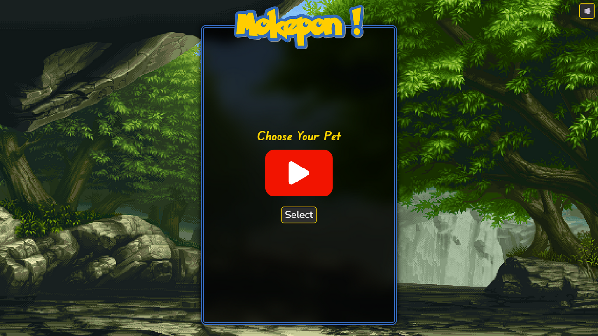

# Mokepon - A Pet Battle Game 🌱💧🔥

This is a web application focused on showcasing TypeScript development and interactive animations trough a pet battle game which involves selection of attacks to emerge victorious.

[](https://youtu.be/V1EOQuuH6vM)

## Directory Structure

```bash
.
├── dist
│   ├── function.js
│   ├── init.js
│   ├── main.js
│   └── model.js
├── img
│   ├── ...
├── node_modules
│   ├── @types
│   │   └── ...
│   ├── animejs
│   │   ├── ...
│   └── typescript
│       ├── ...
├── package-lock.json
├── package.json
├── sounds
│   ├── ...
├── src
│   ├── index.html
│   ├── scripts
│   │   ├── function.ts
│   │   ├── init.ts
│   │   ├── main.ts
│   │   └── model.ts
│   └── style.css
└── tsconfig.json
```

> [!NOTE]
> The `dist/` directory and the JavaScript files located within it are generated by the TypeScript transpilation process.

## Usage

To run the Mokepon project on your local machine, follow these steps:

1. Clone this repository to your local machine or download and extract the ZIP archive.

2. Open a terminal and navigate to the project's root directory.

3. **Build the project:** Before you can run the project, you need to transpile the TypeScript code into JavaScript. You can do this using either of the following methods:

   - Using npm:

     ```bash
     npm install   # Install project dependencies
     npm run build # Transpile TypeScript to JavaScript
     ```

   - Using the TypeScript Compiler (tsc):

     ```bash
     npm install -g typescript  # Install TypeScript globally (if not done already)
     tsc                        # Transpile TypeScript to JavaScript
     ```

4. After the build process completes successfully, you can now open the project in your web browser.

   - Navigate to the `src` directory and open the `index.html` file in your preferred browser.
   - Alternatively, you can set up a local server using tools like `live-server` or `http-server`, and access the project through the server's URL.

5. You should now see the Mokepon application running in your browser. Interact with the app and explore the interactive animations!

## License

This project is released under the [MIT License](LICENSE). Feel free to modify and extend this project for your own use!.
